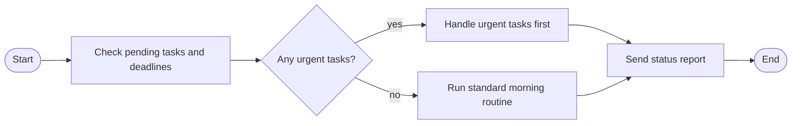

# SpawnBot

ATTENTION: Work In Progress

Autonomous AI agent framework built on [Kimi CLI](https://github.com/anthropics/kimi-cli). Spawn persistent, tool-using agents that operate independently — with Telegram integration, scheduled tasks, memory, and a priority-based input queue.

spawnbot handles the integration layer: external services, persistent memory (SQLite + FTS5), cron scheduling, input routing, and daemon lifecycle. Kimi CLI handles the LLM reasoning via the Wire protocol (JSON-RPC 2.0 over stdio).

```
You ──► Telegram ──► Input Queue ──► Kimi CLI (Wire) ──► MCP Tools ──► Actions
                        ▲                                    │
              Cron jobs ┘                                    ├── Telegram (send/photo/react)
              Autonomy loop ┘                                ├── Memory (store/recall/search)
              Flow skills ┘                                  ├── Tasks (assign/track/complete)
                                                             └── Flow engine (multi-step workflows)
```

## Install

### Prerequisites

- **Node.js 20+** — [nodejs.org](https://nodejs.org)
- **Kimi CLI** — `pip install kimi-cli` or `uv tool install kimi-cli`
- **LLM provider** — Run `kimi login` to authenticate (Anthropic, OpenAI, etc.)

### One-line install

```bash
curl -fsSL https://raw.githubusercontent.com/dawnforge-lab/spawnbot/main/install.sh | bash
```

This installs the framework to `~/.spawnbot/`, then runs the interactive setup wizard automatically. Your agent's config and data live in `~/.spawnbot/agent/`.

To update an existing installation, run the same command — it pulls the latest changes.

### Manual install

```bash
git clone https://github.com/dawnforge-lab/spawnbot.git ~/.spawnbot
cd ~/.spawnbot && npm install
npm link  # or: ln -sf ~/.spawnbot/bin/spawnbot.js ~/.local/bin/spawnbot
spawnbot setup
```

## Quick Start

After install and setup, run your agent:

```bash
# Start the daemon (background)
spawnbot start

# Or run interactively with CLI chat
spawnbot start -f

# Check status
spawnbot status

# Restart after config changes or updates
spawnbot restart

# Send a test prompt
spawnbot prompt "Hello, who are you?"

# Run diagnostics if something isn't working
spawnbot doctor

# Follow logs
spawnbot logs -f
```

All commands work from any directory — they automatically find your agent at `~/.spawnbot/agent/`.

## Setup Wizard

`spawnbot setup` runs an interactive wizard:

**Prerequisites** — Checks Node.js, Kimi CLI, and LLM provider. Offers to run `kimi login` if no provider is configured.

**Run mode** — Choose between system service (auto-start on boot, requires sudo) or manual start/stop. If you pick service, sudo credentials are cached for later.

**Co-creation** — Spawns Kimi CLI with a setup-assistant prompt. You have a conversation to define your agent's personality, voice, safety rules, goals, and playbook. The LLM outputs structured YAML when you're satisfied.

**Integrations & Credentials** — Select optional integrations, collect API keys: Telegram bot token (with auto-detection of chat ID), optional ngrok tunnel for webhooks, optional OpenAI key for voice transcription. Configure cron jobs.

**Generate & Test** — Writes all config files, validates them, generates the MCP config and system prompt, runs a smoke test to verify end-to-end connectivity.

**Service install** — If you opted for system service, installs and starts the systemd unit.

## CLI Reference

### Daemon

```
spawnbot start [-f|--foreground]      Start the daemon (-f for interactive CLI)
spawnbot stop                         Stop the daemon (waits for clean exit)
spawnbot restart                      Stop + start the daemon
spawnbot status                       Daemon status + metrics
```

### One-shot

```
spawnbot prompt "message" [flags]     Send a single prompt (separate session)
  --model <name>                       Override LLM model
  --thinking / --no-thinking           Override thinking mode
```

### Setup & diagnostics

```
spawnbot setup                        Interactive setup wizard (start here)
spawnbot doctor                       Run diagnostic checks (Node, Kimi, DB, Telegram)
spawnbot update                       Pull latest code + regenerate configs + restart
spawnbot upgrade                      Check for and install Kimi CLI updates
spawnbot init                         Initialize project directory (non-interactive)
```

### Config

```
spawnbot config                       Show full merged config
spawnbot config validate              Validate configuration
spawnbot config reload                Send SIGHUP to reload config
spawnbot config generate              Regenerate MCP config + system prompt
```

### Logs

```
spawnbot logs [--wire] [-f|--follow]  Tail log files
```

### System service

```
spawnbot service install              Install systemd service (auto-start on boot, requires sudo)
spawnbot service uninstall            Remove systemd service
spawnbot service status               Show service status
```

### Interactive commands (foreground mode)

When running with `spawnbot start -f`, type `/help` to see available commands:

```
/help              Show available commands
/status            Daemon state, uptime, queue
/queue             Show queue depth and state
/logs              Show last 20 log lines
/clear             Clear terminal
/config            Reload config (hot-reload)
/stop              Stop the daemon and exit
/quit              Same as /stop
```

Anything else you type is sent to the agent as a message.

## Configuration

All config lives in `config/` inside your agent directory. The setup wizard generates these, but you can edit them directly.

### SOUL.yaml — Agent Identity

Defines who the agent is and how it behaves.

```yaml
identity:
  name: Atlas
  tagline: Research assistant
  description: Monitors arxiv and summarizes papers

personality:
  traits:
    analytical: 9
    creative: 7
    assertive: 4
    thorough: 8

voice:
  style: casual
  tone: friendly
  emojis: false
  vocabulary:
    prefer: [analyze, investigate]
    avoid: [maybe, perhaps]

safety:
  stop_phrase: emergency-stop
  hard_limits:
    - Never fabricate citations
  behavior_rules:
    - Always cite sources with links
```

### CRONS.yaml — Scheduled Jobs

```yaml
crons:
  morning_checkin:
    schedule: "0 8 * * *"
    prompt: "Good morning. Check pending tasks and priorities."
    priority: normal
    enabled: true

  daily_routine:
    schedule: "0 9 * * *"
    prompt: "flow:morning-routine"  # Triggers a flow skill
    priority: normal
    enabled: true

  weekly_review:
    schedule: "0 9 * * 1"
    prompt: "Review the codebase, fix issues, update documentation."
    priority: normal
    workspace: true                 # Creates a branch + PR for this job
    enabled: true
```

Jobs with `workspace: true` run in an isolated git branch. The agent creates a `job/<name>-<date>` branch, does the work, commits, opens a PR, and returns to main.

By default, branches are created in the agent's own repo. To work on a separate project, add `project` with the path to any git repo on the machine:

```yaml
crons:
  app_review:
    schedule: "0 9 * * 1"
    prompt: "Review the codebase, fix lint errors, update tests."
    workspace: true
    project: /home/user/work/my-app   # any absolute or ~ path
```

The agent's repo manages its identity/config. The project repo holds the deliverables. The agent `cd`s to the project, creates a branch, does the work, opens a PR, then returns to its own directory.

### GOALS.yaml — Targets & Metrics (Optional)

Revenue targets, KPIs, and progress tracking. Only loaded if the file exists.

### PLAYBOOK.yaml — Action Templates (Optional)

Task categories, routines, and procedures. Only loaded if the file exists.

### .env — Credentials

```bash
TELEGRAM_BOT_TOKEN=your-bot-token
TELEGRAM_CHAT_ID=your-chat-id
# NGROK_AUTHTOKEN=
# NGROK_DOMAIN=
# OPENAI_API_KEY=        # For voice transcription
```

## Flow Skills

Flow skills are multi-step workflows defined as Mermaid flowcharts. Each node is a full LLM turn with tool access. Decision nodes let the agent choose between branches.

Create a flow skill at `skills/<name>/SKILL.md`:

````markdown
---
name: morning-routine
description: Daily morning check-in and task review
type: flow
---


````

The agent can trigger flows via MCP tools (`flow_list`, `flow_start`), cron jobs (`prompt: "flow:name"`), or the HTTP API (`POST /api/flow`).

## GitHub Workspace

The setup wizard can initialize a GitHub repository for your agent. Config files and skills are version-controlled; runtime data and credentials are gitignored.

### Branch-based jobs

Cron jobs with `workspace: true` execute in isolated git branches:

1. Agent creates branch `job/<name>-<YYYY-MM-DD>`
2. Does the work described in the prompt
3. Commits changes and opens a PR
4. Returns to `main`

PRs serve as audit trails — you can review what the agent did, approve, or request changes.

### GitHub webhooks

The daemon accepts GitHub webhook events at `POST /webhook/github` (HMAC-validated with `GITHUB_WEBHOOK_SECRET`). Supported events:

- **Pull requests** — opened, merged, closed
- **PR reviews** — approved, changes requested
- **Issues** — opened

Events are enqueued as low-priority notifications so the agent stays informed about repo activity without interrupting higher-priority work.

### GitHub Actions

When workspace mode is `github`, the setup wizard generates a minimal CI workflow (`.github/workflows/spawnbot-ci.yml`) that runs on PRs from `job/` branches. Extend it with your own tests, linting, or deployment steps.

## Architecture

```
~/.spawnbot/                      # Framework (installed once)
├── bin/
│   ├── spawnbot.js              # CLI entry point
│   ├── mcp-telegram.js          # Telegram MCP server (stdio)
│   └── mcp-core.js              # Core MCP server (stdio)
├── lib/
│   ├── config/                  # Config loading & validation
│   ├── daemon/                  # Daemon lifecycle, PID management
│   ├── db/                      # SQLite + Drizzle ORM
│   ├── flow/                    # Flow engine (parser, runner, loader)
│   ├── http/                    # HTTP server (webhooks, API)
│   ├── input/                   # Priority queue, router, cron, Telegram listener
│   ├── mcp/                     # MCP server implementations
│   ├── persona/                 # System prompt & MCP config generation
│   ├── setup/                   # Interactive setup wizard
│   ├── tunnel/                  # ngrok tunnel management
│   └── wire/                    # Kimi CLI Wire protocol client
└── drizzle/                     # Database migrations

~/.spawnbot/agent/               # Agent instance (default location)
├── config/
│   ├── SOUL.yaml                # Agent identity
│   ├── CRONS.yaml               # Scheduled jobs
│   ├── GOALS.yaml               # Targets (optional)
│   └── PLAYBOOK.yaml            # Procedures (optional)
├── skills/                      # Flow skills and prompt modules
├── data/
│   ├── agent.sqlite             # SQLite database
│   └── logs/                    # Log files
├── integrations/                # Pluggable integration modules
└── .env                         # Credentials
```

### Wire Protocol

Communication with Kimi CLI uses Wire protocol v1.3 — bidirectional JSON-RPC 2.0 over stdin/stdout. The daemon spawns Kimi CLI as a child process and exchanges structured messages:

- **Events** (Kimi → spawnbot): `TurnBegin`, `ContentPart`, `ToolCall`, `ToolResult`, `TurnEnd`
- **Requests** (Kimi → spawnbot): `ApprovalRequest`, `ToolCallRequest`, `QuestionRequest`
- **Prompts** (spawnbot → Kimi): User input, cron triggers, autonomy check-ins, flow nodes

### Input Queue

All input sources feed into a single priority queue:

| Priority | Sources |
|----------|---------|
| Critical | Safeword detection |
| High | Telegram messages, flow triggers |
| Normal | Cron jobs, integrations |
| Low | Autonomy self-check-ins |

The router dequeues one item at a time. Regular items get a single `wire.prompt()` call. Flow items run the full FlowRunner sequence — multiple turns until the flow completes.

### MCP Tools

The agent has access to tools via Model Context Protocol servers:

**Telegram** (6 tools) — `tg_send`, `tg_photo`, `tg_react`, `tg_typing`, `tg_edit`, `tg_delete`

**Memory** (4 tools) — `memory_store`, `memory_recall` (FTS5 full-text search), `memory_search`, `memory_delete`

**Tasks** (5 tools) — `task_search`, `task_categories`, `task_assign`, `task_random`, `task_update`

**Flows** (3 tools) — `flow_list`, `flow_start`, `flow_read`

**Skills** (2 tools) — `skill_list`, `skill_read`

**State** (2 tools) — `state_get`, `state_set`

### HTTP API

The daemon runs an HTTP server on port 31415 for webhooks and external access.

| Endpoint | Auth | Purpose |
|----------|------|---------|
| `GET /health` | None | Health check + uptime |
| `GET /api/status` | API key | Full daemon status |
| `POST /api/prompt` | API key | Enqueue a prompt |
| `POST /api/flow` | API key | Trigger a flow skill |
| `POST /webhook/telegram` | Webhook secret | Telegram updates (auto-configured) |
| `POST /webhook/github` | HMAC signature | GitHub events (PRs, reviews, issues) |

### Database

SQLite with Drizzle ORM, WAL mode, FTS5 for memory search. Auto-created on first run.

| Table | Purpose |
|-------|---------|
| `memories` | Semantic memory with importance scoring |
| `conversations` | Turn history (input/output/tools used) |
| `tasks` | Assigned tasks with status tracking |
| `state` | Key-value daemon state |
| `events` | Audit log (all inputs, outputs, errors) |

## Daemon Lifecycle

```bash
spawnbot start                # Fork to background, write PID file
spawnbot start --foreground   # Run interactively with CLI chat
spawnbot stop                 # Graceful shutdown (SIGTERM → wait → SIGKILL)
spawnbot restart              # Stop + start in one command
spawnbot status               # Check PID + show metrics
spawnbot config reload        # Send SIGHUP to hot-reload config
```

The daemon:
1. Loads config from `config/`
2. Initializes SQLite database
3. Generates MCP config + system prompt
4. Starts HTTP server (port 31415)
5. Spawns Kimi CLI via Wire protocol
6. Starts Telegram listener (polling or webhook)
7. Starts ngrok tunnel (if configured)
8. Starts cron scheduler
9. Enters the input routing loop

On Kimi CLI crash, the daemon auto-restarts with exponential backoff (1s to 30s).

### Foreground mode

`spawnbot start -f` runs interactively with a built-in CLI. Type messages to chat with the agent directly. Use `/help` to see slash commands (`/status`, `/queue`, `/logs`, `/config`, `/stop`). All other inputs (Telegram, cron) still work simultaneously.

To switch a running background daemon to interactive mode:

```bash
spawnbot restart -f
```

This stops the background daemon and restarts it in foreground with the interactive CLI. When you exit (Ctrl+C), the daemon stops — run `spawnbot start` to put it back in the background.

### Systemd service

```bash
spawnbot service install      # Install systemd service (auto-start on boot, requires sudo)
spawnbot service uninstall    # Remove systemd service
spawnbot service status       # Show service status
```

The setup wizard offers to install the service during initial setup. You can also install it later with `spawnbot service install`.

## Logs

```bash
spawnbot logs              # Last 100 lines of spawnbot.log
spawnbot logs -f           # Follow spawnbot.log
spawnbot logs --wire       # Wire protocol event log (JSONL)
spawnbot logs --wire -f    # Follow wire events
```

## License

Apache-2.0
