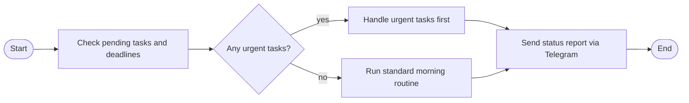

# Flow Skills

How to create and use flow skills — multi-step workflows that run as a sequence of LLM turns.

## What Flow Skills Are

A flow skill is a SKILL.md file with `type: flow` in its frontmatter and a Mermaid flowchart defining the steps. Each node becomes a full LLM turn with tool access. Decision nodes let you branch based on conditions.

## Creating a Flow Skill

Create `skills/<name>/SKILL.md` with this structure:

````markdown
---
name: morning-routine
description: Daily morning check-in and task review
type: flow
---


````

Or use the MCP tool:

```
skill_create({
  name: "morning-routine",
  content: "---\nname: morning-routine\ndescription: Daily check-in\ntype: flow\n---\n\n```mermaid\nflowchart LR\n  BEGIN([Start]) --> check[\"Check tasks\"]\n  check --> END([End])\n```"
})
```

## Node Types

| Shape | Kind | Purpose |
|-------|------|---------|
| `([Start])` | begin | Flow entry point. Must be named `BEGIN`. |
| `([End])` | end | Flow exit point. Must be named `END`. |
| `["Do something"]` | task | Full LLM turn — you execute the instruction with tool access. |
| `{"Is condition met?"}` | decision | You evaluate and choose a branch with `<choice>LABEL</choice>`. |

## Decision Nodes

At a decision node, you evaluate the question and respond with your choice inside `<choice>` tags:

```
<choice>yes</choice>
```

The choice must match one of the edge labels exactly (case-insensitive). If it doesn't match, you'll be prompted to retry.

## Edge Labels

Use `-->|label|` syntax for labeled edges (required on decision branches):

```mermaid
decide{"Condition?"} -->|yes| doA["Handle yes"]
decide -->|no| doB["Handle no"]
```

Unlabeled edges (`-->`) are used for sequential task-to-task connections.

## Running Flows

Three ways to trigger a flow:

1. **MCP tool**: `flow_start({ name: "morning-routine" })`
2. **Cron job**: Set `prompt: "flow:morning-routine"` in CRONS.yaml
3. **HTTP API**: `POST /api/flow` with `{ "name": "morning-routine" }`

## Available Flow Tools

- `flow_list` — list all flow skills
- `flow_read({ name })` — read a flow's nodes and edges
- `flow_start({ name })` — trigger a flow execution

## Tips

- Keep node labels short and actionable — they become your instructions
- Each node is a full turn, so you have full tool access at every step
- Decision nodes should ask clear yes/no or categorical questions
- Flows have a 200-move safety limit
- Test flows with `flow_start` before adding them to cron jobs
